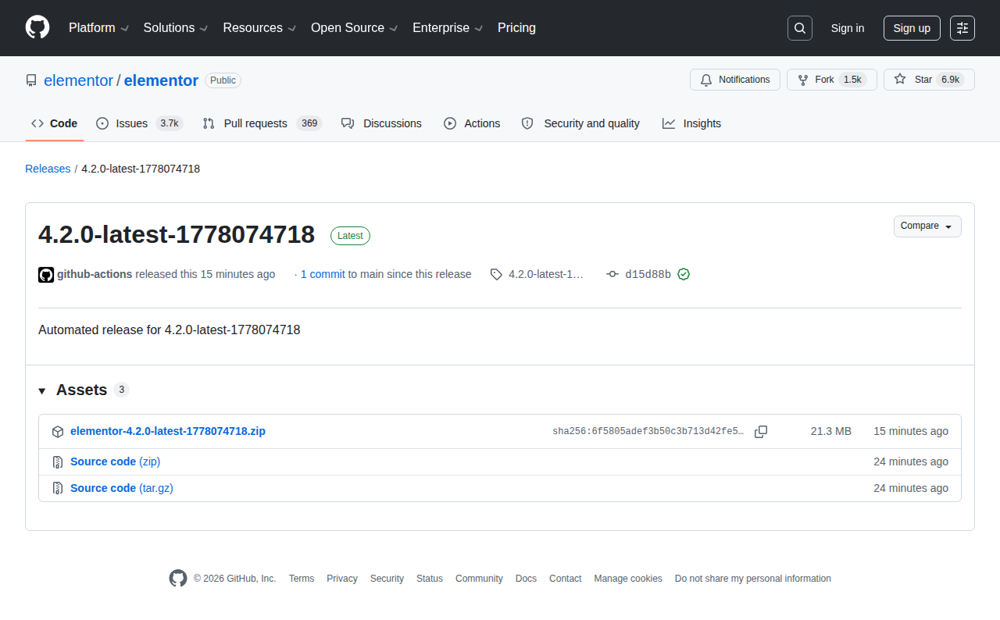

# Visited: https://github.com/elementor/elementor/releases/tag/4.2.0-latest-1778074718
**Time:** Wed May  6 14:02:38 UTC 2026

## Screenshot

## Raw HTML
[page.html](./page.html)

## Downloaded Media (4 files)
## Downloaded Media Files

## Other Links
- [#start-of-content](#start-of-content)
- [/](/)
- [/apps/github-actions](/apps/github-actions)
- [/elementor](/elementor)
- [/elementor/elementor](/elementor/elementor)
- [/elementor/elementor/actions](/elementor/elementor/actions)
- [/elementor/elementor/commit/d15d88be2969b8b06fc817e7a41a5cb4e7eeb85a](/elementor/elementor/commit/d15d88be2969b8b06fc817e7a41a5cb4e7eeb85a)
- [/elementor/elementor/compare/4.2.0-latest-1778074718...main](/elementor/elementor/compare/4.2.0-latest-1778074718...main)
- [/elementor/elementor/discussions](/elementor/elementor/discussions)
- [/elementor/elementor/issues](/elementor/elementor/issues)
- [/elementor/elementor/pulls](/elementor/elementor/pulls)
- [/elementor/elementor/pulse](/elementor/elementor/pulse)
- [/elementor/elementor/refs?tag_name=4.2.0-latest-1778074718&amp;experimental=1](/elementor/elementor/refs?tag_name=4.2.0-latest-1778074718&amp;experimental=1)
- [/elementor/elementor/releases](/elementor/elementor/releases)
- [/elementor/elementor/releases/latest](/elementor/elementor/releases/latest)
- [/elementor/elementor/releases/tag/4.2.0-latest-1778074718](/elementor/elementor/releases/tag/4.2.0-latest-1778074718)
- [/elementor/elementor/security](/elementor/elementor/security)
- [/elementor/elementor/tags](/elementor/elementor/tags)
- [/elementor/elementor/tree/4.2.0-latest-1778074718](/elementor/elementor/tree/4.2.0-latest-1778074718)
- [/login?return_to=%2Felementor%2Felementor](/login?return_to=%2Felementor%2Felementor)
- [/login?return_to=https%3A%2F%2Fgithub.com%2Felementor%2Felementor%2Freleases%2Ftag%2F4.2.0-latest-1778074718](/login?return_to=https%3A%2F%2Fgithub.com%2Felementor%2Felementor%2Freleases%2Ftag%2F4.2.0-latest-1778074718)
- [/manifest.json](/manifest.json)
- [/opensearch.xml](/opensearch.xml)
- [/search/custom_scopes/check_name](/search/custom_scopes/check_name)
- [/signup?ref_cta=Sign+up&amp;ref_loc=header+logged+out&amp;ref_page=%2F%3Cuser-name%3E%2F%3Crepo-name%3E%2Freleases%2Fshow&amp;source=header-repo&amp;source_repo=elementor%2Felementor](/signup?ref_cta=Sign+up&amp;ref_loc=header+logged+out&amp;ref_page=%2F%3Cuser-name%3E%2F%3Crepo-name%3E%2Freleases%2Fshow&amp;source=header-repo&amp;source_repo=elementor%2Felementor)
- [https://archiveprogram.github.com](https://archiveprogram.github.com)
- [https://avatars.githubusercontent.com](https://avatars.githubusercontent.com)
- [https://avatars.githubusercontent.com/in/15368?s=40&amp;v=4](https://avatars.githubusercontent.com/in/15368?s=40&amp;v=4)
- [https://docs.github.com](https://docs.github.com)
- [https://docs.github.com/](https://docs.github.com/)
- [https://docs.github.com/github/authenticating-to-github/displaying-verification-statuses-for-all-of-your-commits](https://docs.github.com/github/authenticating-to-github/displaying-verification-statuses-for-all-of-your-commits)
- [https://docs.github.com/search-github/github-code-search/understanding-github-code-search-syntax](https://docs.github.com/search-github/github-code-search/understanding-github-code-search-syntax)
- [https://docs.github.com/site-policy/github-terms/github-terms-of-service](https://docs.github.com/site-policy/github-terms/github-terms-of-service)
- [https://docs.github.com/site-policy/privacy-policies/github-privacy-statement](https://docs.github.com/site-policy/privacy-policies/github-privacy-statement)
- [https://github-cloud.s3.amazonaws.com](https://github-cloud.s3.amazonaws.com)
- [https://github.blog](https://github.blog)
- [https://github.blog/changelog](https://github.blog/changelog)
- [https://github.com](https://github.com)
- [https://github.com/accelerator](https://github.com/accelerator)
- [https://github.com/collections](https://github.com/collections)
- [https://github.com/customer-stories](https://github.com/customer-stories)
- [https://github.com/elementor/elementor/releases/expanded_assets/4.2.0-latest-1778074718](https://github.com/elementor/elementor/releases/expanded_assets/4.2.0-latest-1778074718)
- [https://github.com/enterprise](https://github.com/enterprise)
- [https://github.com/enterprise/startups](https://github.com/enterprise/startups)
- [https://github.com/features](https://github.com/features)
- [https://github.com/features/actions](https://github.com/features/actions)
- [https://github.com/features/code-review](https://github.com/features/code-review)
- [https://github.com/features/codespaces](https://github.com/features/codespaces)
- [https://github.com/features/copilot](https://github.com/features/copilot)
- [https://github.com/features/copilot/copilot-business](https://github.com/features/copilot/copilot-business)

## Stats
- Links: 192
- Media: 4
